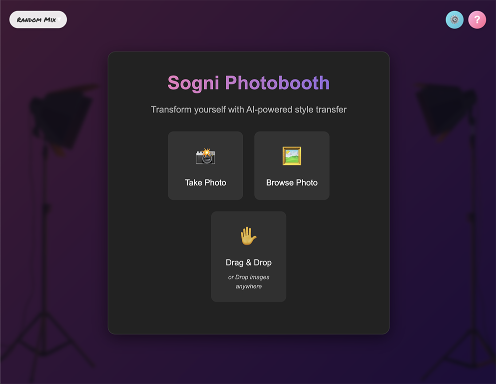
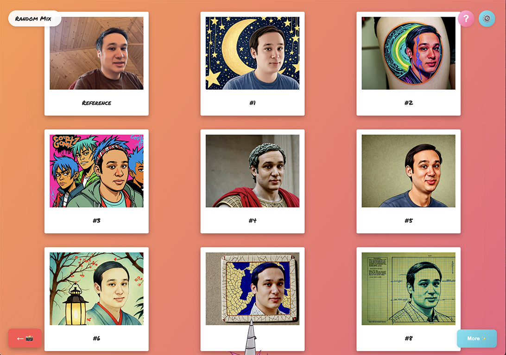

# Sogni Photobooth

[](LICENSE)
[](CONTRIBUTING.md)

An "AI photobooth" web app that allows users to snap a selfie or upload a photo via desktop or mobile, then quickly generate a series of stylised portraits without having to download AI models or have a powerful GPU. This is a demo application powered by the whitelabel Sogni Client SDK and open-sourced to give developers a solid example to fork or reference for their own Sogni Supernet powered applications.

If you build something cool with the Sogni Client SDK let us know and we'll add it to the growing list of "Sogni Superapps": https://www.sogni.ai/super-apps

Live demo → **https://photobooth.sogni.ai**

<div align="center">
  
  
  
</div>

---

## ✨ Features
- **State-of-the-art Character Transfer / Identity-Preserving Stylized Synthesis** – keeps your face while transforming the style.
- **Mobile & Desktop** – webcam support, camera-roll upload, drag-and-drop.
- **One-Click Local Dev** – Vite + Nodemon + script runner.
- **Style Presets & Customization** - Pick between 150+ style prompts or write your own. Pick different models and customize model guidance settings.
- **DePIN Powered** – no model downloads or local GPU needed; up to 64 concurrent jobs on the Sogni Supernet.
- **Secure Backend** – credentials live only in the Node server; the browser never sees them.
- **Live Progress** – real-time SSE and per-image progress bars.

> You'll need a free [Sogni account](https://www.sogni.ai) + tokens for inference jobs.

---

## 📑 Table of Contents
1. [Quick Start](#-quick-start)
2. [Project Layout](#-project-layout)
3. [Configuration](#️-configuration)
4. [Testing](#-testing)
5. [Production Build & Deploy](#-production-build--deploy)
6. [Contributing](#-contributing)
7. [License](#-license)
8. [Acknowledgements](#-acknowledgements)

---

## 🚀 Quick Start

### 1 · Clone & install
```bash
# clone
git clone https://github.com/Sogni-AI/sogni-photobooth.git
cd sogni-photobooth

# installs root deps *and* runs the npm **prepare** script which installs /server deps
npm install
```

### 2 · Backend credentials
```bash
cp server/.env.example server/.env   # edit the values
```
Minimal example:
```
SOGNI_APP_ID=photobooth-local   # optional; autogenerated if blank
SOGNI_USERNAME=your_username
SOGNI_PASSWORD=your_password
SOGNI_ENV=local                # local | staging | production
PORT=3001
CLIENT_ORIGIN=https://photobooth-local.sogni.ai

# Redis Configuration (optional, for Analytics, improved session management, Twitter/X sharing)
REDIS_HOST=localhost
REDIS_PORT=6379
REDIS_PASSWORD=
REDIS_DB_INDEX=1
REDIS_VERBOSE_LOGGING=true
```

### 3 · Configure Local Hosts & SSL Certificate

For the best local development experience, we use Nginx as a reverse proxy to handle SSL and route traffic to the appropriate services (frontend and backend) on separate subdomains.

**a. Update your hosts file:**
   You\'ll need to map the local development domains to your loopback address. Add the following lines to your `/etc/hosts` file (or equivalent for your OS):

   ```
   127.0.0.1 photobooth-local.sogni.ai
   127.0.0.1 photobooth-api-local.sogni.ai
   ```

**b. Ensure SSL Certificate is Valid:**
   The Nginx configuration (`scripts/nginx/local.conf`) is set up to use SSL certificates located at:
   - `/opt/homebrew/etc/nginx/ssl/sogni-local.crt`
   - `/opt/homebrew/etc/nginx/ssl/sogni-local.key`

   These certificates **must be valid for both** `photobooth-local.sogni.ai` and `photobooth-api-local.sogni.ai`.
   If you\'re not using Nginx, you can still run the frontend on http://localhost:5175 and the backend on http://localhost:3001. However, the API calls from the frontend (if accessed via localhost:5175) are configured in `src/config/urls.ts` to also target `https://photobooth-api-local.sogni.ai` by default for the `development` environment, which would require the hosts file and a running Nginx (or direct backend exposure on that domain with valid SSL for that domain).

### 4 · Configure Nginx and Run in dev mode (two terminals)

Before starting the development servers, ensure Nginx is running and configured to use the local setup.

**a. Configure Nginx:**
   Copy the provided Nginx configuration file from this project to your Nginx server configuration directory. A common location for Homebrew Nginx is `/opt/homebrew/etc/nginx/servers/`.

   ```bash
   # Run from the project root directory
   cp scripts/nginx/local.conf /opt/homebrew/etc/nginx/servers/photobooth-local.conf
   ```
   *(Note: You might need `sudo` depending on permissions. Alternatively, you could create a symbolic link instead of copying.)*

**b. Reload Nginx:**
   Apply the configuration changes by reloading or restarting Nginx.

   ```bash
   # Example for Homebrew Nginx
   brew services restart nginx
   # Or, using nginx directly:
   # sudo nginx -s reload
   ```

**c. Run Development Servers:**
   Now, start the React front-end and the Node Express back-end in separate terminals.

```bash
# Terminal 1 – backend
cd server && npm run dev

# Terminal 2 – frontend (in project root)
npm run dev
```
Visit **https://photobooth-local.sogni.ai**. The frontend will make API calls to **https://photobooth-api-local.sogni.ai**.

### Optional script runner

If you prefer not to keep terminals open, you can use the script runner. This will start the services in the background and log to files in the 
`logs/` directory.

```bash
./scripts/run.sh start   # starts front & back in background
./scripts/run.sh status  # see logs / ports
```

---

## 🗂 Project Layout
```
├─ src/           # React frontend
│  ├─ components/
│  ├─ services/   # browser-side API helpers
│  └─ ...
├─ server/        # Express backend (API → Sogni SDK)
│  ├─ routes/
│  └─ services/
├─ scripts/       # helper CLI & deployment scripts
├─ tests/         # Playwright visual tests & Jest unit tests
└─ screenshots/   # demo images used in this README
```

---

## ⚙️ Configuration

| File | Purpose |
|------|---------|
| `server/.env` | Backend secrets, CORS origin, Redis configuration |
| `.env.local` | Local frontend configuration including Google Analytics settings |
| `.env.staging` | Staging frontend configuration for builds |
| `.env.production` | Production frontend configuration for builds |
| `configs/local/*.conf` | Nginx local SSL reverse-proxy |
| `scripts/nginx/local.conf` | Main Nginx configuration for local development, defining frontend and backend subdomains. Expects SSL certs at `/opt/homebrew/etc/nginx/ssl/`. |

### Analytics Configuration

The application supports Google Analytics for basic page tracking. To enable it:

1. Create a `.env.local` file in the project root with the following variables:
   ```
   # Google Analytics Configuration
   # Set to 'false' to disable GA completely
   VITE_GA_ENABLED=true
   # Your Google Analytics measurement ID (e.g., G-XXXXXXXXXX)
   VITE_GA_MEASUREMENT_ID=G-XXXXXXXXXX
   # Domain for cookies, set to 'auto' for default behavior or specify 'sogni.ai' to share across subdomains
   VITE_GA_DOMAIN=sogni.ai
   ```

2. The analytics implementation:
   - Respects user privacy by making it easy to disable
   - Supports cross-subdomain tracking for sogni.ai domains
   - Only records basic page views by default (camera view, photo gallery, individual photos)
   - Provides infrastructure for future event tracking if needed
   - Includes version tracking for better data segmentation

### Redis Configuration

The application utilizes Redis for session management and persistence of Twitter/X OAuth data when using the photo sharing functionality:

1. Add these Redis configuration variables to your `server/.env` file:
   ```
   # Redis Configuration
   REDIS_HOST=localhost
   REDIS_PORT=6379
   REDIS_PASSWORD=
   REDIS_DB_INDEX=1
   REDIS_VERBOSE_LOGGING=true
   ```

2. Redis benefits:
   - Provides persistent session storage for Twitter/X OAuth flow
   - Falls back to in-memory storage if Redis is unavailable
   - Automatically handles TTL (Time-To-Live) for session data
   - Improves scalability when deploying to multiple server instances

Redis is optional - if not available, the system will use in-memory storage as a fallback.

### SSL & Custom Domain (optional)
Running Nginx with the provided `scripts/nginx/local.conf` uses SSL certificates (expected at `/opt/homebrew/etc/nginx/ssl/sogni-local.crt` and `sogni-local.key` - see **Quick Start - Step 3b** for creation/validation instructions using `openssl`) so you can use **https://photobooth-local.sogni.ai** for the frontend and **https://photobooth-api-local.sogni.ai** for the backend, with secure cookies and proper CORS handling.

The `./scripts/run.sh nginx` command is deprecated. Manual Nginx configuration and certificate management as described in **Quick Start - Step 3** is the recommended approach for this setup.

---

## 🧪 Testing

```bash
# unit + component tests
npm test

# visual regression (HTML report)
npm run test:visual
```
Full visual refactor workflow:
```bash
npm run test:visual:baseline  # capture
# …make changes…
npm run test:visual:refactor  # compare & report
```

---

## 📦 Production Build & Deploy

```bash
# Build for production
npm run build            # Uses .env.production for frontend config

# Build for staging
npm run build:staging    # Uses .env.staging for frontend config

# Deploy to production (requires server/.env.production)
npm run deploy:production

# Deploy to staging (requires server/.env.staging and .env.staging)
npm run deploy:staging
```

Deploy `/dist` to your static host and `/server` behind Node (PM2, systemd, etc.).  
Make sure **PORT**, **CLIENT_ORIGIN**, **Redis configuration** (if using Twitter sharing), and SSL are configured.

---

## 🤝 Contributing
Pull requests are welcome!  
Please run `npm run lint` and `npm run test:visual` before submitting.

We follow the standard [Contributor Covenant](https://www.contributor-covenant.org/version/2/1/code_of_conduct/) Code of Conduct.

---

## 📜 License

Licensed under the **MIT License**.  See [`LICENSE`](LICENSE) for the full text.

---

## 🙏 Acknowledgements
- **Sogni AI** – for the SDK & Supernet that powers this application. [More "Superapps"](https://www.sogni.ai/super-apps)
- **Stable Diffusion SDXL** – <https://huggingface.co/docs/diffusers/en/using-diffusers/sdxl>
- **ControlNet** – <https://github.com/lllyasviel/ControlNet>
- **Instant ID** – <https://github.com/instantX-research/InstantID>
- **Cursor AI** – the AI pair-programmer used to vibe-code this sample repo.

For questions, feedback, or support feel free to reach us at **dream@sogni.ai** 
